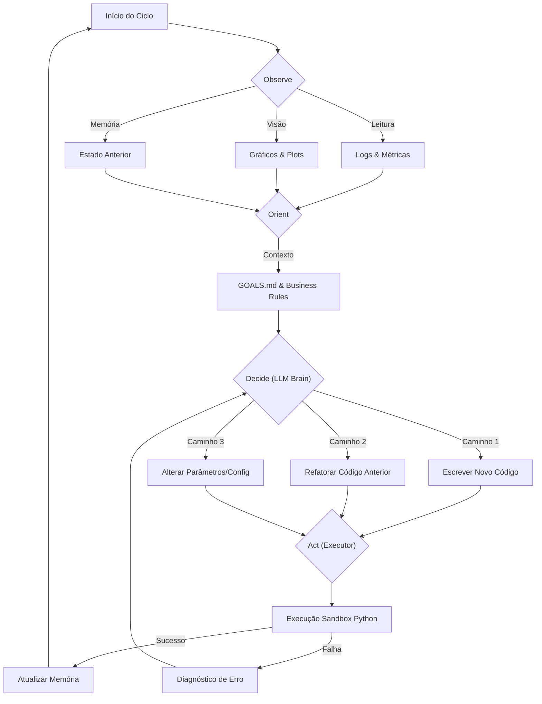

# 🧬 Ralph Sabor DS: Autonomous Data Science Engineer

  

**Ralph Sabor Data Scientist** é um framework de agente autônomo projetado para emular o fluxo de trabalho cognitivo de um Cientista de Dados.

Diferente de pipelines de AutoML tradicionais que executam uma busca linear ou em grade (Grid Search), o Ralph opera em um ciclo contínuo de raciocínio, codificação, análise visual e tomada de decisão estratégica baseada em objetivos de negócio.

---

## 📖 Filosofia e Motivação

### O Problema da Linearidade

A Engenharia de Software tradicional é determinística: especifica-se a entrada e a saída, e constrói-se o caminho. A Ciência de Dados é **estocástica e exploratória**.

1.**O Feedback Loop:** Em DS, um erro não é apenas uma falha de execução; é uma informação sobre a distribuição dos dados. Um pipeline linear falha quando encontra um *drift* inesperado. Um agente precisa "parar, olhar e corrigir".

2.**A Arte da Decisão:** A escolha entre uma Regressão Bayesiana e uma Rede Neural não é apenas uma questão de acurácia. Envolve interpretabilidade, custo computacional e apetite de risco. O Ralph pondera esses fatores consultando as "Leis do Projeto" (`GOALS.md`).

3.**Visão Além dos Números:** Um `MSE: 0.04` pode esconder um viés sistemático que apenas um olho humano detectaria ao ver um gráfico de resíduos com padrão heterocedástico. O Ralph utiliza **Modelos de Visão (VLM)** para "enxergar" essa geometria.

---

## 🏗️ Arquitetura do Sistema

O sistema implementa um **Loop OODA (Observe, Orient, Decide, Act)** persistente, mantendo estado de memória semelhante a um ambiente Jupyter Notebook.

### Diagrama de Fluxo Cognitivo



### Componentes Core

1. **The Brain (`brain.py`):**

   * O orquestrador central baseado em LLM (GPT-4o ou Gemini 1.5 Pro).
   * Responsável pelo planejamento estratégico e geração de código dinâmico.
   * **Injeta contexto do projeto:** colunas reais (`state/metadata.json`), decisões já tomadas, resumo de análise e **todo o conteúdo da pasta `context/`** nos prompts, para o agente não partir do zero.
2. **The Vision Critic (`vision_critic.py`):**

   * Módulo especializado que recebe imagens geradas pelo código.
   * Utiliza *Intent Injection*: analisa o gráfico com base no que o código *tentou* mostrar (ex: "Verificar normalidade").
3. **The Stateful Executor (`executor.py`):**

   * Mantém o namespace Python vivo entre iterações.
   * Gerencia a persistência de objetos complexos (DataFrames, Modelos) e metadados em `state/`.

---

## 📂 Pasta de Contexto (`context/`)

O agente **não parte do zero**. Toda documentação, exemplos de código e convenções que você colocar na pasta **`context/`** são **lidos automaticamente** pelo Brain e injetados nas chamadas à LLM.

### O que colocar em `context/`

| Tipo                                     | Exemplo                                                                |
| ---------------------------------------- | ---------------------------------------------------------------------- |
| **Documentação**                 | Regras de negócio, glossário, checklists em `.md` ou `.txt`.     |
| **Exemplos de código**            | Pipeline legado (ex.:`credit_scoring_pipeline.py`), padrões de EDA. |
| **Configurações de referência** | `.yaml` ou `.json` que o agente deve seguir como padrão.          |

### Formato

* **Extensões lidas:** `.md`, `.py`, `.txt`, `.yaml`, `.json`.
* **Ordem:** alfabética por nome de arquivo (prefixe com números se quiser ordem fixa: `01_objetivos.md`, `02_pipeline_exemplo.py`).
* O Brain concatena o conteúdo até um limite de caracteres para caber no contexto da LLM; arquivos muito grandes podem ser truncados.

### Regra de segurança

* **Não** coloque dados sensíveis ou secrets em `context/`.
* Use esta pasta para que o agente **reutilize** padrões do projeto, exemplos que funcionaram e documentação técnica.

### Pipeline legado

O pipeline de referência está em `context/credit_scoring_pipeline.py`. Para executá-lo a partir da raiz do projeto:

```bash
python context/credit_scoring_pipeline.py
```

(O `cwd` deve ser a raiz do projeto para encontrar `train.parquet`, `test.parquet`, etc.)

---

## 🚀 Ciclo de Vida de uma Análise

O Ralph não segue um script pré-definido. Ele constrói o script. Exemplo de um fluxo real em  **Credit Scoring** :

### Fase 1: Diagnóstico (EDA)

***Ação:** O Agente escreve um script para carregar dados e plotar nulos.

***Visão:** O Vision Critic detecta que `feature_757` tem 93% de nulos.

***Decisão:** O Agente consulta a política e decide remover a feature em vez de imputar, para evitar ruído.

### Fase 2: Modelagem Iterativa

***Ação:** Treina um XGBoost Baseline.

***Observação:** Detecta um Gap de 15% entre Treino e Validação (Overfitting).

***Reação:** O Agente não avança. Ele decide reescrever a configuração de hiperparâmetros, reduzindo `max_depth` e aumentando `gamma`.

***Resultado:** Novo treino mostra Gap de 3%. O Agente aprova e segue.

### Fase 3: Validação de Negócio

***Ação:** Calcula a curva de lucro baseada na matriz de custos.

***Observação:** O lucro máximo ocorre aprovando apenas 20% da base.

***Conflito:** O `GOALS.md` exige aprovação mínima de 60%.

***Ajuste:** O Agente recalibra o threshold, reporta a queda de eficiência financeira aceitando o trade-off para cumprir a meta de volume.

---

## 🛠️ Instalação e Uso

### Pré-requisitos

* Python 3.10+
* Chaves de API (OpenAI ou Google AI Studio)

### Setup Inicial

Comandos (Bash):

```bash
# 1. Clone o repositório

git clone [https://github.com/seu-usuario/ralph-sabor-ds.git](https://github.com/seu-usuario/ralph-sabor-ds.git)

cd ralph-sabor-ds


# 2. Instale dependências

pip install -r requirements.txt


# 3. Configure o ambiente

cp .env.example .env

# Edite o .env com suas chaves: GEMINI_KEY=... ou OPENAI_API_KEY=...

```

### Estrutura do Projeto (este repositório)

```text
project_root/
├── GOALS.md              # Critérios de sucesso
├── config.yaml           # Parâmetros (Single Source of Truth)
├── CHANGELOG.md          # Histórico de experimentos
├── brain.py              # Cerebro (OODA + injeção de contexto)
├── agent_controller.py   # Orquestrador alternativo
├── executor.py           # Executor stateful
├── vision_critic.py      # Análise visual (Intent Injection)
├── context/              # Contexto do agente (lido automaticamente)
│   ├── README.md
│   └── credit_scoring_pipeline.py   # Pipeline legado de referência
├── notebooks/            # Scripts gerados pelo agente (01_...py, 02_...py, ...)
├── state/                # Pickles e metadata.json (estado entre passos)
├── reports/              # Relatórios .md e plots
├── train.parquet         # Dados de treino (READ-ONLY)
└── test.parquet          # Dados de teste (READ-ONLY)
```

### Executando o Agente

Para rodar o agente (ex.: Credit Scoring neste repositório):

```bash
python brain.py --mode auto
```

Ou via controller:

```bash
python agent_controller.py
```

O Agente irá:

1. Ler os objetivos em **`GOALS.md`** e os parâmetros em **`config.yaml`**.
2. Carregar contexto da pasta **`context/`** (documentação, exemplos, pipeline legado).
3. Carregar dados de **`train.parquet`** e **`test.parquet`** (READ-ONLY; dados processados vão para **`state/`**).
4. Gerar notebooks em **`notebooks/`**, relatórios em **`reports/`** e estado em **`state/`**.

---

## 🧠 Customização do Agente

Para adaptar o Ralph a novos domínios, você não altera o código do orquestrador (`brain.py`, `agent_controller.py`); você altera as **regras e o contexto do projeto**:

| Artefato                   | Função                                                                                 |
| -------------------------- | ---------------------------------------------------------------------------------------- |
| **`GOALS.md`**     | Define o que é sucesso (KPIs, restrições éticas, latência).                         |
| **`config.yaml`**  | Single Source of Truth: parâmetros do modelo, feature flags. Nunca hardcodar em Python. |
| **`CHANGELOG.md`** | Histórico imutável de experimentos; o agente lê antes de iniciar.                     |
| **`context/`**     | Documentação, exemplos e convenções lidos pelo agente (não partir do zero).         |
| **`src/*.py`**     | Funções de domínio (ex.: PD para crédito) para o agente importar.                    |

### Regras críticas (`.cursorrules`)

* **Data Safety:** `train.parquet` e `test.parquet` são **READ-ONLY**. Dados processados devem ser salvos em **`state/`** (ex.: `state/train_processed.parquet`) ou em arquivos com sufixo (ex.: `train_processed_06_feature_cleanup.parquet`).
* **Logging:** Usar **MarkdownLogger** (ou `logger.log()` / `logger.log_metric()` / `logger.log_plot()`); **não** usar `print()` para saída analítica.
* **Erro:** Se um passo falhar, registrar em **`CHANGELOG.md`** como "FAILED" e reverter **`config.yaml`** ao último estado funcional; o agente prefere **edit_code** ou **rollback** a **stop**.

---

## 🤝 Contribuição

Este projeto é uma exploração de  **Agentic Engineering** . Pull requests são bem-vindos, especialmente para:

* Novos *Critics* (ex: Analista de Código Estático).
* Suporte a novas ferramentas de visualização.
* Melhorias na recuperação de falhas do Executor.

---

*"Me fail English? That's unpossible!"* — Ralph Wiggum
