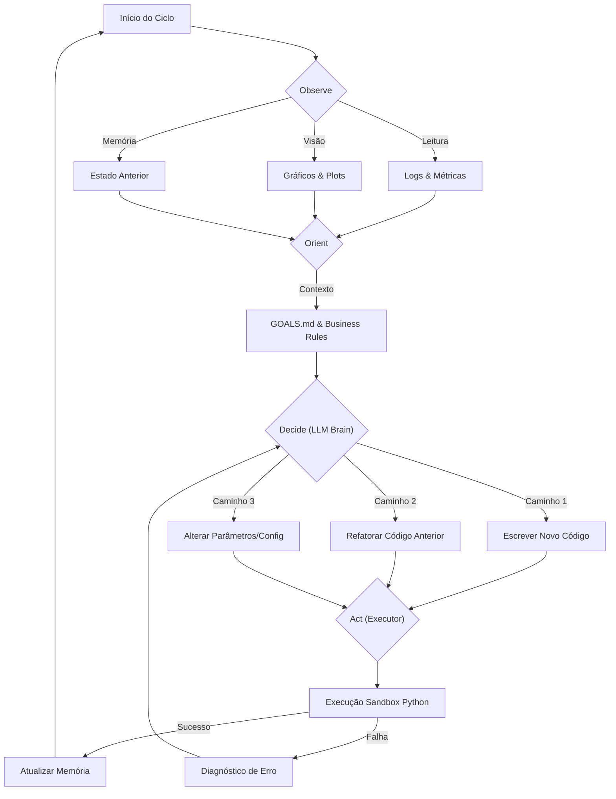

# 🧬 Ralph Sabor DS: Autonomous Data Science Engineer

  

**Ralph Sabor DS** é um framework de agente autônomo projetado para emular o fluxo de trabalho cognitivo de um Cientista de Dados Sênior.

Diferente de pipelines de AutoML tradicionais que executam uma busca linear ou em grade (Grid Search), o Ralph opera em um ciclo contínuo de raciocínio, codificação, análise visual e tomada de decisão estratégica baseada em objetivos de negócio.

---

## 📖 Filosofia e Motivação

### O Problema da Linearidade

A Engenharia de Software tradicional é determinística: especifica-se a entrada e a saída, e constrói-se o caminho. A Ciência de Dados é **estocástica e exploratória**.

1. **O Feedback Loop:** Em DS, um erro não é apenas uma falha de execução; é uma informação sobre a distribuição dos dados. Um pipeline linear falha quando encontra um *drift* inesperado. Um agente precisa "parar, olhar e corrigir".
2. **A Arte da Decisão:** A escolha entre uma Regressão Bayesiana e uma Rede Neural não é apenas uma questão de acurácia. Envolve interpretabilidade, custo computacional e apetite de risco. O Ralph pondera esses fatores consultando as "Leis do Projeto" (`GOALS.md`).
3. **Visão Além dos Números:** Um `MSE: 0.04` pode esconder um viés sistemático que apenas um olho humano detectaria ao ver um gráfico de resíduos com padrão heterocedástico. O Ralph utiliza **Modelos de Visão (VLM)** para "enxergar" essa geometria.

### A Abordagem "Sabor"

O nome "Sabor" refere-se à capacidade do agente de adaptar seu comportamento ao contexto específico ("sabor") do problema de negócio — seja conservador para Risco de Crédito ou agressivo para Marketing.

---

## 🏗️ Arquitetura do Sistema

O sistema implementa um **Loop OODA (Observe, Orient, Decide, Act)** persistente, mantendo estado de memória semelhante a um ambiente Jupyter Notebook.

### Diagrama de Fluxo Cognitivo




### Componentes Core

1. **The Brain (`core/brain.py`):**
   * O orquestrador central baseado em LLM (GPT-4o ou Gemini 1.5 Pro).
   * Responsável pelo planejamento estratégico e geração de código dinâmico.
2. **The Vision Critic (`core/vision_critic.py`):**
   * Módulo especializado que recebe imagens geradas pelo código.
   * Utiliza  *Intent Injection* : Analisa o gráfico com base no que o código *tentou* mostrar (ex: "Verificar normalidade").
3. **The Stateful Executor (`core/executor.py`):**
   * Mantém o namespace Python vivo entre iterações.
   * Gerencia a persistência de objetos complexos (DataFrames, Modelos) e metadados.

---

## 🚀 Ciclo de Vida de uma Análise

O Ralph não segue um script pré-definido. Ele constrói o script. Exemplo de um fluxo real em  **Credit Scoring** :

### Fase 1: Diagnóstico (EDA)

* **Ação:** O Agente escreve um script para carregar dados e plotar nulos.
* **Visão:** O Vision Critic detecta que `feature_757` tem 93% de nulos.
* **Decisão:** O Agente consulta a política e decide remover a feature em vez de imputar, para evitar ruído.

### Fase 2: Modelagem Iterativa

* **Ação:** Treina um XGBoost Baseline.
* **Observação:** Detecta um Gap de 15% entre Treino e Validação (Overfitting).
* **Reação:** O Agente não avança. Ele decide reescrever a configuração de hiperparâmetros, reduzindo `max_depth` e aumentando `gamma`.
* **Resultado:** Novo treino mostra Gap de 3%. O Agente aprova e segue.

### Fase 3: Validação de Negócio

* **Ação:** Calcula a curva de lucro baseada na matriz de custos.
* **Observação:** O lucro máximo ocorre aprovando apenas 20% da base.
* **Conflito:** O `GOALS.md` exige aprovação mínima de 60%.
* **Ajuste:** O Agente recalibra o threshold, reporta a queda de eficiência financeira aceitando o trade-off para cumprir a meta de volume.

---

## 🛠️ Instalação e Uso

### Pré-requisitos

* Python 3.10+
* Chaves de API (OpenAI ou Google AI Studio)

### Setup Inicial

**Bash**

```
# 1. Clone o repositório
git clone [https://github.com/seu-usuario/ralph-sabor-ds.git](https://github.com/seu-usuario/ralph-sabor-ds.git)
cd ralph-sabor-ds

# 2. Instale dependências
pip install -r requirements.txt

# 3. Configure o ambiente
cp .env.example .env
# Edite o .env com suas chaves: GEMINI_KEY=... ou OPENAI_API_KEY=...
```

### Executando uma Instância (Projeto)

Para rodar o agente em um projeto específico (ex: Credit Scoring):

**Bash**

```
python main.py --instance credit_scoring_v1 --mode auto --max-iterations 30
```

O Agente irá:

1. Ler o contexto em `instances/credit_scoring_v1/GOALS.md`.
2. Carregar dados de `instances/credit_scoring_v1/inputs/`.
3. Gerar notebooks e relatórios em `instances/credit_scoring_v1/outputs/`.

---

## 🧠 Customização do Agente

Para adaptar o Ralph a novos domínios, você não altera o código fonte (`core/`), você altera as  **Regras da Instância** :

* **`GOALS.md`:** Define o que é sucesso (KPIs, Restrições Éticas, Latência).
* **`config.yaml`:** Define o espaço de busca inicial e  *feature flags* .
* **`src/*.py`:** Injete funções de domínio específicas (ex: cálculo de LTV para marketing ou PD para crédito) para o agente importar.

---

## 🤝 Contribuição

Este projeto é uma exploração de  **Agentic Engineering** . Pull requests são bem-vindos, especialmente para:

* Novos *Critics* (ex: Analista de Código Estático).
* Suporte a novas ferramentas de visualização.
* Melhorias na recuperação de falhas do Executor.

---

*"Me fail English? That's unpossible!"* — Ralph Wiggum

```
