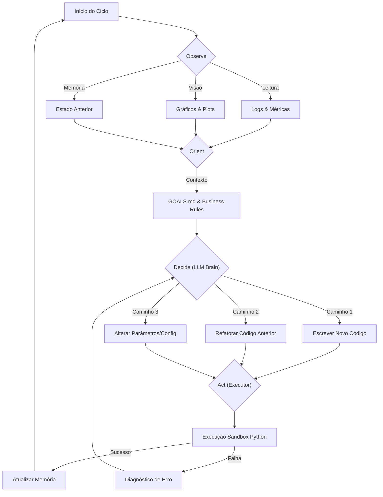

# 🧬 Ralph DS v2.0: Agente Autônomo de Data Science

  

**Ralph DS** é um agente autônomo **AGNÓSTICO** que resolve qualquer problema de Data Science.

## Novidades da v2.0

- **Agnóstico ao Domínio**: Detecta automaticamente o tipo de problema (classificação, regressão, etc.)
- **EDA Obrigatória**: Todo problema começa com análise exploratória
- **STATE.md**: Memória resumida para não reler todos os arquivos
- **Planejamento Dinâmico**: TASK_LIST adaptativa baseada nos insights
- **context/data/**: Dados e contexto do projeto em um só lugar

Diferente de pipelines de AutoML tradicionais que executam uma busca linear, o Ralph opera em um ciclo contínuo de raciocínio, codificação, análise visual e tomada de decisão estratégica.

---

## 📖 Filosofia e Motivação

### O Problema da Linearidade

A Engenharia de Software tradicional é determinística: especifica-se a entrada e a saída, e constrói-se o caminho. A Ciência de Dados é **estocástica e exploratória**.

1.**O Feedback Loop:** Em DS, um erro não é apenas uma falha de execução; é uma informação sobre a distribuição dos dados. Um pipeline linear falha quando encontra um *drift* inesperado. Um agente precisa "parar, olhar e corrigir".

2.**A Arte da Decisão:** A escolha entre uma Regressão Bayesiana e uma Rede Neural não é apenas uma questão de acurácia. Envolve interpretabilidade, custo computacional e apetite de risco. O Ralph pondera esses fatores consultando as "Leis do Projeto" (`GOALS.md`).

3.**Visão Além dos Números:** Um `MSE: 0.04` pode esconder um viés sistemático que apenas um olho humano detectaria ao ver um gráfico de resíduos com padrão heterocedástico. O Ralph utiliza **Modelos de Visão (VLM)** para "enxergar" essa geometria.

---

## 🏗️ Arquitetura do Sistema

O sistema implementa um **Loop OODA (Observe, Orient, Decide, Act)** persistente, mantendo estado de memória semelhante a um ambiente Jupyter Notebook.

### Diagrama de Fluxo Cognitivo



### Componentes Core

1. **The Brain (`brain.py`):**

   * O orquestrador central baseado em LLM (GPT-4o ou Gemini 1.5 Pro).
   * Responsável pelo planejamento estratégico e geração de código dinâmico.
   * **Injeta contexto do projeto:** colunas reais (`state/metadata.json`), decisões já tomadas, resumo de análise e **todo o conteúdo da pasta `context/`** nos prompts, para o agente não partir do zero.
2. **The Vision Critic (`vision_critic.py`):**

   * Módulo especializado que recebe imagens geradas pelo código.
   * Utiliza *Intent Injection*: analisa o gráfico com base no que o código *tentou* mostrar (ex: "Verificar normalidade").
3. **The Stateful Executor (`executor.py`):**

   * Mantém o namespace Python vivo entre iterações.
   * Gerencia a persistência de objetos complexos (DataFrames, Modelos) e metadados em `state/`.

---

## 📂 Pasta de Contexto (`context/`)

O agente **não parte do zero**. Toda documentação, exemplos de código e convenções que você colocar na pasta **`context/`** são **lidos automaticamente** pelo Brain e injetados nas chamadas à LLM.

### O que colocar em `context/`

* **Documentação:** regras de negócio, glossário, checklists em `.md` ou `.txt`.
* **Exemplos de código:** pipeline legado (ex.: `credit_scoring_pipeline.py`), padrões de EDA.
* **Configurações de referência:** `.yaml` ou `.json` que o agente deve seguir como padrão.

### Formato

* **Extensões lidas:** `.md`, `.py`, `.txt`, `.yaml`, `.json`.
* **Ordem:** alfabética por nome de arquivo (prefixe com números se quiser ordem fixa: `01_objetivos.md`, `02_pipeline_exemplo.py`).
* O Brain concatena o conteúdo até um limite de caracteres para caber no contexto da LLM; arquivos muito grandes podem ser truncados.

### Regra de segurança

* **Não** coloque dados sensíveis ou secrets em `context/`.
* Use esta pasta para que o agente **reutilize** padrões do projeto, exemplos que funcionaram e documentação técnica.

### Pipeline legado

O pipeline de referência está em `context/credit_scoring_pipeline.py`. Para executá-lo a partir da raiz do projeto:

```bash
python context/credit_scoring_pipeline.py
```

(O `cwd` deve ser a raiz do projeto para encontrar `train.parquet`, `test.parquet`, etc.)

---

## 🎯 Tipos de Problema Suportados

O Ralph detecta automaticamente o tipo de problema após a EDA:

| Tipo | Detecção | Métricas | Pipeline |
|------|----------|----------|----------|
| **Classificação Binária** | Target com 2 valores | AUC, F1, Precision, Recall | XGBoost + Threshold Opt |
| **Classificação Multiclasse** | Target com 3-10 valores | F1 Macro, Accuracy | XGBoost + Calibração |
| **Regressão** | Target contínuo | RMSE, MAE, R² | XGBoost + Residual Analysis |
| **Desconhecido** | Não detectado | - | Apenas EDA |

---

## 🚀 Ciclo de Vida de uma Análise

O Ralph não segue um script pré-definido. Ele constrói o script dinamicamente.

### Fase 0: Inicialização

```
1. Ler GOALS.md (objetivos)
2. Ler context/ (dados, documentação, exemplos)
3. Carregar STATE.md (se existir)
4. Criar pasta runs/YYYYMMDD_HHMMSS/
```

### Fase 1: EDA Obrigatória

Todo problema passa por EDA antes de qualquer modelagem:

```
01_load_data    → Carregar dados, gerar metadata
02_eda_overview → Visão geral (shape, tipos, memória)
03_eda_nulls    → Valores faltantes por feature
04_eda_target   → Distribuição do target (detecta tipo de problema!)
05_eda_distrib  → Distribuições das features
06_eda_corr     → Correlações e redundâncias
07_eda_drift    → Comparação treino vs teste (se aplicável)
```

### Fase 2: Detecção de Tipo e Planejamento

Após a EDA do target, o agente:
1. Detecta automaticamente o tipo de problema
2. Gera TASK_LIST dinâmica baseada no tipo
3. Atualiza STATE.md com decisões

### Fase 3: Modelagem Iterativa

O agente executa o pipeline apropriado para o tipo de problema detectado.

### Fase 4: Documentação Final

O agente gera report.md completo e exporta artefatos.

---

## 📋 Ciclo de planejamento dinâmico (essência)

**Única referência fixa:** `GOALS.md`. TASK_LIST, etapas e código são construídos dinamicamente.

1. **Objetivos** → ler GOALS. **Contexto** → context/, state/metadata.json, config.yaml. **O que já rodou** → state/, runs/, CHANGELOG.
2. **TASK_LIST** → ler e comparar com objetivos e com o que foi executado.
3. **Ajustes na TASK_LIST?** Se sim: add/remove/edit etapas; criar scripts em `notebooks/` para etapas novas. Se não: rodar de onde parou.
4. **Rodar próxima etapa** → analisar resultados (prints, relatórios, imagens). Isso altera planejamento? Código atual? Próxima/futura/passada?
5. **Alterar passado** → editar TASK_LIST e/ou código dos steps; rodar tudo de novo a partir da etapa alterada (`run_from_step`).
6. **Alterar atual** → edit_code no step atual; rodar de novo e analisar.
7. **Alterar futuro** → atualizar TASK_LIST e criar scripts se necessário; pode repensar o fluxo a cada análise. Só GOALS não muda.

**Ações do Brain:** `UPDATE_TASK_LIST` (add_steps, remove_steps, edit_steps, run_from), `RUN_FROM_STEP`, `EDIT_CODE`, `WRITE_CODE`, `RUN_STEP`. Replanejamento persistido em TASK_LIST.md (todas as sessões).

---

## 🛠️ Instalação e Uso

### Pré-requisitos

* Python 3.10+
* Chaves de API (OpenAI ou Google AI Studio)

### Setup Inicial

Comandos (Bash):

```bash
# 1. Clone o repositório

git clone [https://github.com/seu-usuario/ralph-sabor-ds.git](https://github.com/seu-usuario/ralph-sabor-ds.git)

cd ralph-sabor-ds


# 2. Instale dependências

pip install -r requirements.txt


# 3. Configure o ambiente

cp .env.example .env

# Edite o .env com suas chaves: GEMINI_KEY=... ou OPENAI_API_KEY=...

```

### Estrutura do Projeto (v2.0)

```text
project_root/
├── GOALS.md              # 🎯 Critérios de sucesso (única referência fixa)
├── STATE.md              # 📊 Memória resumida (atualizada pelo agente)
├── TASK_LIST.md          # 📋 Fila de tarefas (dinâmica)
├── config.yaml           # ⚙️ Parâmetros (Single Source of Truth)
├── CHANGELOG.md          # 📝 Histórico de experimentos
│
├── brain.py              # 🧠 Cérebro (OODA + detecção de tipo de problema)
├── executor.py           # ▶️ Executor stateful
├── vision_critic.py      # 👁️ Análise visual (Intent Injection)
├── markdown_logger.py    # 📝 Logging estruturado
│
├── context/              # 📚 Contexto do projeto (agnóstico)
│   ├── README.md         # Documentação do problema
│   ├── exemplos/         # Código de referência
│   └── data/             # 📁 DADOS DO PROJETO (READ-ONLY)
│       ├── train.parquet
│       └── test.parquet
│
├── src/                  # ⚙️ Módulos Python (código pesado)
│   └── __init__.py       # Começa vazio, agente cria sob demanda
│
├── notebooks/            # 📓 Scripts gerados (chamam src/)
│   ├── 01_load_data.py
│   ├── 02_eda_overview.py
│   └── ...
│
├── state/                # 💾 Estado persistente
│   ├── metadata.json     # Decisões, métricas, tipo de problema
│   └── step_*.pkl        # Pickles por step
│
└── runs/                 # 📊 Uma pasta por execução
    └── YYYYMMDD_HHMMSS/
        ├── report.md     # Log da execução
        └── *.png         # Visualizações
```

### Executando o Agente

Para rodar o agente (ex.: Credit Scoring neste repositório):

```bash
python brain.py --mode auto
```

Ou via controller:

```bash
python agent_controller.py
```

O Agente irá:

1. Ler os objetivos em **`GOALS.md`** e os parâmetros em **`config.yaml`**.
2. Carregar contexto da pasta **`context/`** (documentação, exemplos, pipeline legado).
3. Carregar dados de **`train.parquet`** e **`test.parquet`** (READ-ONLY; dados processados vão para **`state/`**).
4. Criar uma pasta **`runs/YYYYMMDD_HHMMSS/`** para esta execução; todos os reports e plots da run vão para ela.
5. Para contexto, o agente lê apenas **`state/`** (metadata, decisões) e a **run atual** (não centenas de execuções antigas).

### Múltiplas execuções e histórico

* **Uma pasta por run:** Cada vez que você roda o agente (`python brain.py --mode auto`), é criada **`runs/YYYYMMDD_HHMMSS/`**. Todos os plots e relatórios daquela execução ficam nessa pasta.
* **Contexto enxuto:** O agente **não** carrega o histórico de todas as runs antigas para decidir. Ele usa **`state/metadata.json`** (decisões, métricas, colunas) e, se existir, o resumo do último report **da run atual** (ou de `README_ANALISE.md`). Assim você pode rodar o fluxo inteiro do zero várias vezes, sem poluir o contexto com centenas de execuções.
* **Histórico preservado:** As pastas em **`runs/`** ficam guardadas para inspeção humana ou para `scripts/sync_report_to_readme.py` (que busca o .md mais recente em `runs/` e depois em `reports/`).

---

## 🧠 Customização do Agente

Para adaptar o Ralph a novos domínios, você não altera o código do orquestrador (`brain.py`, `agent_controller.py`); você altera as **regras e o contexto do projeto**:

* **`GOALS.md`:** define o que é sucesso (KPIs, restrições éticas, latência).
* **`config.yaml`:** Single Source of Truth: parâmetros do modelo, feature flags. Nunca hardcodar em Python.
* **`CHANGELOG.md`:** histórico imutável de experimentos; o agente lê antes de iniciar.
* **`context/`:** documentação, exemplos e convenções lidos pelo agente (não partir do zero).
* **`src/*.py`:** funções de domínio (ex.: PD para crédito) para o agente importar.

### Regras críticas (`.cursorrules`)

* **Data Safety:** `train.parquet` e `test.parquet` são **READ-ONLY**. Dados processados devem ser salvos em **`state/`** (ex.: `state/train_processed.parquet`) ou em arquivos com sufixo (ex.: `train_processed_06_feature_cleanup.parquet`).
* **Logging:** Usar **MarkdownLogger** (log, log_metric, log_plot) para escrever no report; **não** usar `print()` para saída analítica. A análise das imagens com Vision é feita pelo **brain** via **Vision Critic** após cada step (scripts não chamam Vision).
* **Erro:** Se um passo falhar, registrar em **`CHANGELOG.md`** como "FAILED" e reverter **`config.yaml`** ao último estado funcional; o agente prefere **edit_code** ou **rollback** a **stop**.

---

## 🤝 Contribuição

Este projeto é uma exploração de  **Agentic Engineering** . Pull requests são bem-vindos, especialmente para:

* Novos *Critics* (ex: Analista de Código Estático).
* Suporte a novas ferramentas de visualização.
* Melhorias na recuperação de falhas do Executor.

---

*"Me fail English? That's unpossible!"* — Ralph Wiggum
